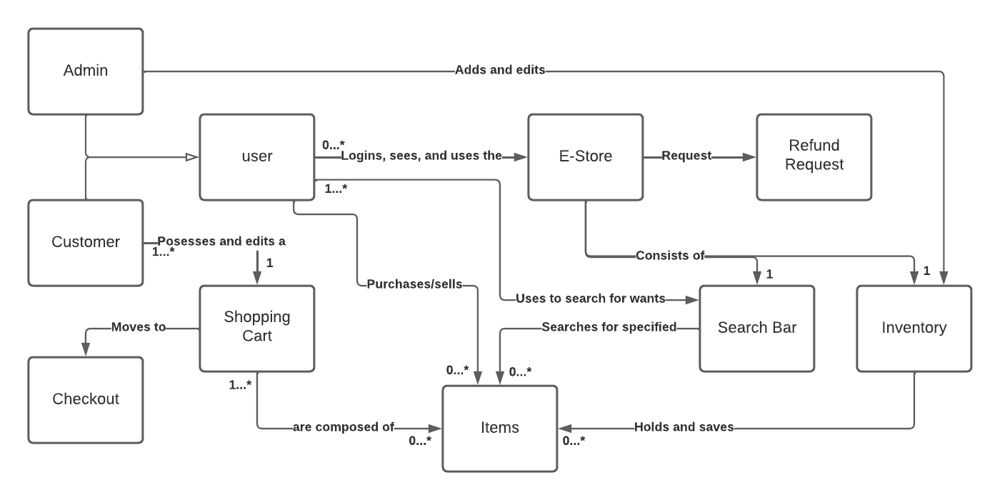
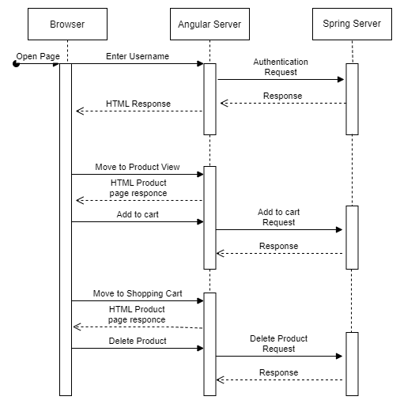
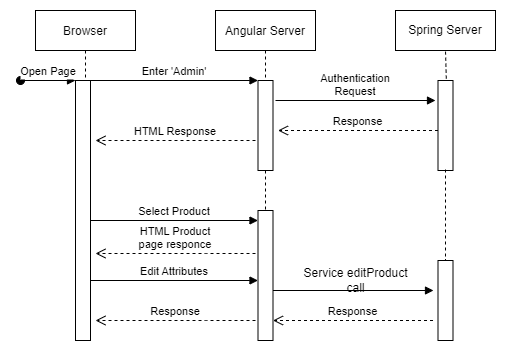

# PROJECT Design Documentation

> _The following template provides the headings for your Design
> Documentation.  As you edit each section make sure you remove these
> commentary 'blockquotes'; the lines that start with a > character
> and appear in the generated PDF in italics._

## Team Information
* Team name: Jadin
* Team members
  * Alen Van  
  * Nicholas Lewandowski
  * Donald Burke
  * Isaac Post
  * Joseph Doros

## Executive Summary

This project is to create a working e-store that allows customers to browse and purchase products that have been posted by an admin of the store.

### Purpose
> _Provide a very brief statement about the project and the most
> important user group and user goals._

### Glossary and Acronyms
> _Provide a table of terms and acronyms._

| Term | Definition |
|------|------------|
| SPA | Single Page |

## Requirements

This section describes the features of the application.

> _In this section you do not need to be exhaustive and list every
> story.  Focus on top-level features from the Vision document and
> maybe Epics and critical Stories._

### Definition of MVP
> _Provide a simple description of the Minimum Viable Product._

### MVP Features
> _Provide a list of top-level Epics and/or Stories of the MVP._

### Roadmap of Enhancements
> _Provide a list of top-level features in the order you plan to consider them._

## Application Domain

This section describes the application domain.

The main components of the application domain can be seen as the following:
customer, inventory, product, shopping cart, admin.

The admin is the overseer of the store, manipulating the inventory to how they see fit, adding or deleting products.
Customers view the inventory, and select products based on their preference and add it to their shopping cart.
Once added to the shopping cart, customers are able to checkout, essentially purchasing the product and removing it from the inventory in the process.

## Architecture and Design

This section describes the application architecture.

### Summary

The following Tiers/Layers model shows a high-level view of the webapp's architecture.

The e-store web application, is built using the Model–View–ViewModel (MVVM) architecture pattern. 

The Model stores the application data objects including any functionality to provide persistance. 

The View is the client-side SPA built with Angular utilizing HTML, CSS and TypeScript. The ViewModel provides RESTful APIs to the client (View) as well as any logic required to manipulate the data objects from the Model.

Both the ViewModel and Model are built using Java and Spring Framework. Details of the components within these tiers are supplied below.

### Overview of User Interface

This section describes the web interface flow; this is how the user views and interacts
with the e-store application.

> _Provide a summary of the application's user interface.  Describe, from
> the user's perspective, the flow of the pages in the web application._

### View Tier
> _Provide a summary of the View Tier UI of your architecture.
> Describe the types of components in the tier and describe their
> responsibilities.  This should be a narrative description, i.e. it has
> a flow or "story line" that the reader can follow._

> _You must also provide sequence diagrams as is relevant to a particular aspects 
> of the design that you are describing.  For example, in e-store you might create a 
> sequence diagram of a customer searching for an item and adding to their cart. 
> Be sure to include an relevant HTTP reuqests from the client-side to the server-side 
> to help illustrate the end-to-end flow._

### ViewModel Tier
> _Provide a summary of this tier of your architecture. This
> section will follow the same instructions that are given for the View
> Tier above._

The ViewModel is the set of classes that take data passed in by the View, which is the front-end web store, and send it too the Model, that is the back-end data. In our project, you can expect to find classes called controllers (InventoryController, UserController, and ShoppingCartController) that recieve Http requests from the View. The controller classes take these requests and figure out what functions from the Model the View is requesting. These classes then call that function and return the data that was requested by the View. In the end, the ViewModel tier is used as a connection betwen Model and View through the use of the InventoryController, UserController, and ShoppingCartController classes.

> _At appropriate places as part of this narrative provide one or more
> static models (UML class diagrams) with some details such as critical attributes and methods._

### Model Tier

WIthin the model tier we can expect to find 2 types of components, the file data access objects and any neccessary object classes to help. Some of these neccessary objects are objects like the product class and users class. The product class creates objects that holds information on a singular product that is being sold in the e-store, whereas a user holds information about a user who interacts with the e-store. The fil data access objects are objects that takes care of saving, loading, and manipulation of any sort of data that is to be utilized throughout the entire e-store. Examples of such data can be seen as the inventory, or a customer's shopping cart. The inventory must be saved and loaded in order for users to see a constantly updated inventory of products. Shopping carts must be saved so that if a customer logs out, and then logs back in, they should still have their shopping cart and continue to add, delete, and overall edit the shopping cart.

> _At appropriate places as part of this narrative provide one or more
> static models (UML class diagrams) with some details such as critical attributes and methods._

### Static Code Analysis/Design Improvements
> _Discuss design improvements that you would make if the project were
> to continue. These improvement should be based on your direct
> analysis of where there are problems in the code base which could be
> addressed with design changes, and describe those suggested design
> improvements._

> _With the results from the Static Code Analysis exercise, 
> discuss the resulting issues/metrics measurements along with your analysis
> and recommendations for further improvements. Where relevant, include 
> screenshots from the tool and/or corresponding source code that was flagged._

## Testing

### Acceptance Testing

6 User stories in total
3 pass all of their acceptance criteria tests
2 Have not had any testing yet

### Unit Testing and Code Coverage

Unit Testing Strategy: 

Create a single test file for each file that has implementations of methods.
Create tests for every possible execution path, for example, a method that has an if else, we write two tests,
one to test the if block, and the other to test the else block.
Whenever creating a new instance of an object that has an interface to pair with it, utilize the interface to create the object. Specifically for mock objects. This follows the interface segregation principle in the SOLID principles, this allows the conformity of hiding an unneccessary code that the client does not need to know of.

Code Coverage: 94% achieved

Discussion:

The team's coverage targets were the controllers, persistence as well as any objects that are utilized between the 2 tiers of classes. The reason for this is because by testing these classes, we can atleast determine whetehr or not an issue that arises in the entirety of the program is either in the front end or back end. With well created unit tests, we can determine that something must have happened in the front end or during the connection between the two ends.

The target coverage goal was 90%, as shown above, we were able to not only achieve this but exceed this by 4%.

