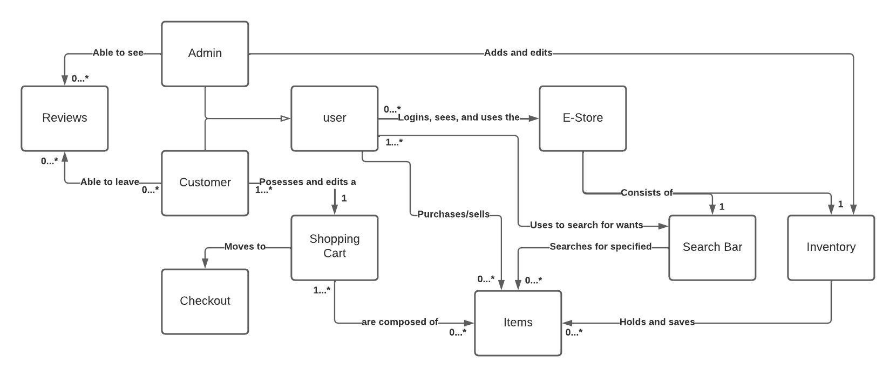
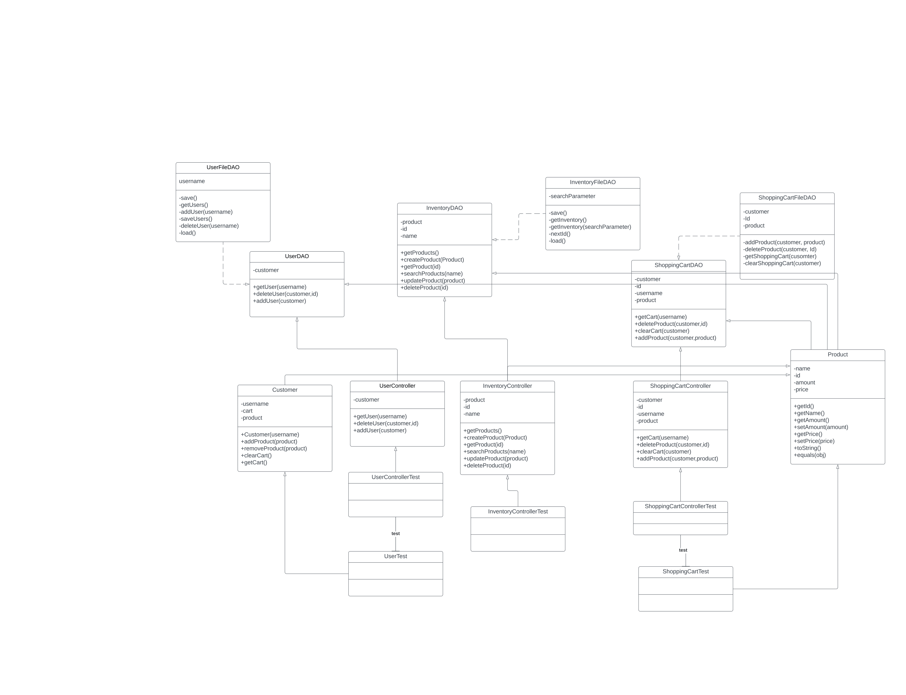
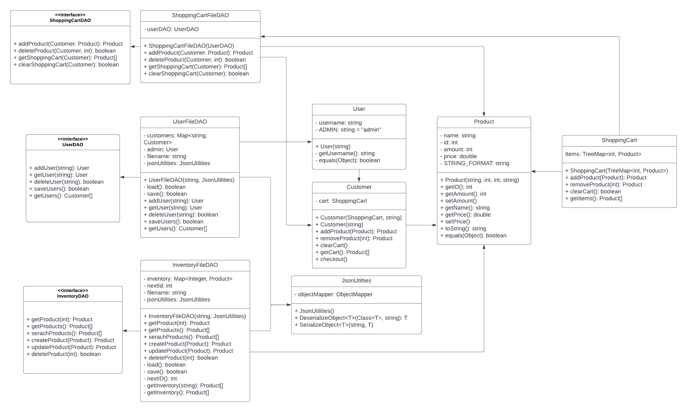
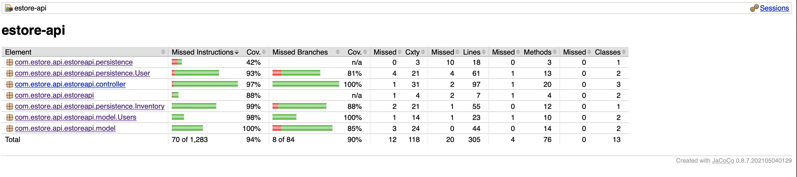

# PROJECT Design Documentation

## Team Information
* Team name: Jadin
* Team members
  * Alen Van  
  * Nicholas Lewandowski
  * Donald Burke
  * Isaac Post
  * Joseph Doros

## Executive Summary

This project is to create a working e-store that allows customers to browse and purchase products that have been posted by an admin of the store.

### Purpose

The purpose of the project is to host a place for consumers and sellers to have a market in order to transact with one another seeking to meet their demands.

### Glossary and Acronyms
> _Provide a table of terms and acronyms._

| Term | Definition |
|------|------------|
| SPA | Single Page |

## Requirements

### Definition of MVP

A website configured as an e-store to give interactions between sellers and buyers as one party seeks a product that conforms to their likings, and the other sells there goods.

### MVP Features
As a customer I want to be able to view the products on the website in order to buy the product.
As a customer I want to be able to edit my shopping cart in order to purchase products.
As a customer I want to be able to search for products in order to quickly find the things I'm looking for.
As a customer I want to be able to leave a review in order to give feedback.

As an admin I want to be able to edit the inventory to see how I see fit in order to sell my products.
As an admin I want to be able to be able to view the e-store in order to interact with it.
As an admin I want to be able to view customer review in order to gain insight on customer reactions.

### Roadmap of Enhancements
Product
Inventory
User
Customer
Shopping Cart
Website
Search Bar
Reviews

## Application Domain

This section describes the application domain.

The main components of the application domain can be seen as the following:
customer, inventory, product, shopping cart, admin.

The admin is the overseer of the store, manipulating the inventory to how they see fit, adding or deleting products.
Customers view the inventory, and select products based on their preference and add it to their shopping cart.
Once added to the shopping cart, customers are able to checkout, essentially purchasing the product and removing it from the inventory in the process.

## Architecture and Design

This section describes the application architecture.

### Summary

The following Tiers/Layers model shows a high-level view of the webapp's architecture.

The e-store web application, is built using the Model–View–ViewModel (MVVM) architecture pattern. 

The Model stores the application data objects including any functionality to provide persistance. 

The View is the client-side SPA built with Angular utilizing HTML, CSS and TypeScript. The ViewModel provides RESTful APIs to the client (View) as well as any logic required to manipulate the data objects from the Model.

Both the ViewModel and Model are built using Java and Spring Framework. Details of the components within these tiers are supplied below.

### Overview of User Interface

This section describes the web interface flow; this is how the user views and interacts
with the e-store application.

The user begins at the home page with only the option to login to ensure a user account is being cached. After this, if the username is the admin username, the user, who is an owner, will be able to see the inventory as well as add and delete items. Once an item is clicked, the owner will be able to edit the price, stock and name of the product. If the user logs in as a customer, the interface is changed to the user-storefront where they can see the inventory without some of the rights that the admin has. They are able to click on a product in order to view the product's details as well as add it to their cart. From the user-storefront, the customer can click on the Shopping Cart link to be routed to their current shopping cart. From there they can remove any items they wish.

### View Tier

For an admin, in the user-login component, once the 'admin' username is typed in and the log in button is pressed, an http GET request will be sent to the backend to handle. Once a response is received, it will send you to the admin storefront. In the case of a user, that same process will also generate a GET request for the backend to handle, which will add the user to the users.json file if not already added.
Once logged in as an admin, the inventory component will work with the product-details and product service to use http GET, POST and DELETE requests to manage the inventory. As a user the user-store, shopping-cart, user-product-view, and product-search components all use GET, POST, UPDATE and DELETE, and utilize the shopping-cart and user services to produce the user's view of the storefront and transfer to the product details and shopping cart views.

### ViewModel Tier

The ViewModel is the set of classes that take data passed in by the View, which is the front-end web store, and send it too the Model, that is the back-end data. In our project, you can expect to find classes called controllers (InventoryController, UserController, and ShoppingCartController) that recieve Http requests from the View. The controller classes take these requests and figure out what functions from the Model the View is requesting. These classes then call that function and return the data that was requested by the View. In the end, the ViewModel tier is used as a connection betwen Model and View through the use of the InventoryController, UserController, and ShoppingCartController classes.

### Model Tier

WIthin the model tier we can expect to find 2 types of components, the file data access objects and any neccessary object classes to help. Some of these neccessary objects are objects like the product class and users class. The product class creates objects that holds information on a singular product that is being sold in the e-store, whereas a user holds information about a user who interacts with the e-store. The fil data access objects are objects that takes care of saving, loading, and manipulation of any sort of data that is to be utilized throughout the entire e-store. Examples of such data can be seen as the inventory, or a customer's shopping cart. The inventory must be saved and loaded in order for users to see a constantly updated inventory of products. Shopping carts must be saved so that if a customer logs out, and then logs back in, they should still hacd ve their shopping cart and continue to add, delete, and overall edit the shopping cart.

### Static Code Analysis/Design Improvements
> _Discuss design improvements that you would make if the project were
> to continue. These improvement should be based on your direct
> analysis of where there are problems in the code base which could be
> addressed with design changes, and describe those suggested design
> improvements._

> _With the results from the Static Code Analysis exercise, 
> discuss the resulting issues/metrics measurements along with your analysis
> and recommendations for further improvements. Where relevant, include 
> screenshots from the tool and/or corresponding source code that was flagged._

## Testing

### Acceptance Testing

6 User stories in total
3 pass all of their acceptance criteria tests
2 Have not had any testing yet

### Unit Testing and Code Coverage

Unit Testing Strategy: 

Create a single test file for each file that has implementations of methods.
Create tests for every possible execution path, for example, a method that has an if else, we write two tests,
one to test the if block, and the other to test the else block.
Whenever creating a new instance of an object that has an interface to pair with it, utilize the interface to create the object. Specifically for mock objects. This follows the interface segregation principle in the SOLID principles, this allows the conformity of hiding an unneccessary code that the client does not need to know of.

Code Coverage: 94% achieved

Discussion:

The team's coverage targets were the controllers, persistence as well as any objects that are utilized between the 2 tiers of classes. The reason for this is because by testing these classes, we can atleast determine whetehr or not an issue that arises in the entirety of the program is either in the front end or back end. With well created unit tests, we can determine that something must have happened in the front end or during the connection between the two ends.

The target coverage goal was 90%, as shown above, we were able to not only achieve this but exceed this by 4%.

